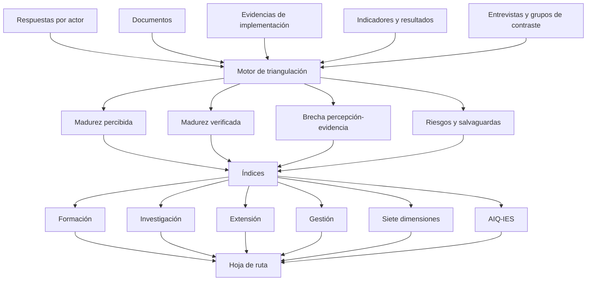
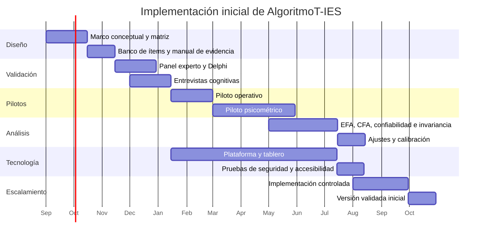

# Propuesta metodológica e instrumental para AlgoritmoT-IES

## Resumen ejecutivo

AlgoritmoT dispone actualmente de una metodología de diagnóstico organizacional basada en seis dimensiones —estrategia, talento y cultura, procesos y automatización, experiencia del cliente, infraestructura y datos, y gobernanza y liderazgo—, operacionalizada en una batería de 180 preguntas Likert, treinta por dimensión. El prototipo normaliza las respuestas en una escala de 0 a 100, calcula un cociente digital general —DQ—, un cociente de inteligencia artificial —AIQ— y genera visualizaciones, interpretaciones y líneas de acción. fileciteturn0file0 Su documentación metodológica complementa la encuesta con entrevistas, revisión documental, benchmarking, priorización de brechas, hoja de ruta e implementación. fileciteturn0file1

La adaptación a instituciones de educación superior no debería limitarse a sustituir vocabulario empresarial —por ejemplo, “cliente” por “estudiante”—. Una institución de educación superior crea valor público mediante formación, investigación, creación, innovación, extensión, cultura y transformación social. Además, combina autonomía académica, participación colegiada, aseguramiento de la calidad, libertad de investigación, responsabilidad pública y atención a poblaciones diversas. Por ello, se propone convertir AlgoritmoT en un **modelo matricial de madurez institucional**, denominado **AlgoritmoT-IES**, con cuatro líneas misionales y siete dimensiones transversales.

Las cuatro líneas serán:

| Línea | Propósito evaluado |
|---|---|
| Formación y docencia | Calidad, pertinencia, inclusión e innovación de los procesos de enseñanza, aprendizaje, evaluación y acompañamiento. |
| Investigación, innovación y creación | Generación, gestión, apertura, integridad, transferencia e impacto del conocimiento. |
| Extensión y proyección social | Relacionamiento, educación continua, innovación social, transferencia y contribución territorial. |
| Gestión institucional habilitante | Planeación, calidad, personas, procesos, tecnología, datos, bienestar, infraestructura y gobierno que sostienen las líneas misionales. |

Las siete dimensiones transversales serán:

1. Estrategia, gobierno y aseguramiento de la calidad.
2. Cultura, talento y competencias.
3. Diseño y gestión de procesos misionales.
4. Datos, analítica y gestión del conocimiento.
5. Infraestructura, arquitectura y seguridad.
6. Experiencia, inclusión y participación.
7. Innovación, ecosistemas e impacto.

Esta arquitectura recoge la lógica holística de Jisc, que analiza capacidad digital y de IA, infraestructura, datos y conocimiento, educación, investigación, experiencia, alianzas, sostenibilidad e inclusión; asimismo, Jisc recomienda completar el diagnóstico colaborativamente con responsables de educación, investigación y servicios profesionales. citeturn8search3 Se alinea también con EDUCAUSE, cuyo instrumento de preparación institucional para IA organiza la conversación en estrategia, gobernanza, tecnología, fuerza laboral y enseñanza-aprendizaje, con participación interfuncional. citeturn8search5 HEInnovate aporta la lógica de autoevaluación colectiva orientada a convertir reflexión institucional en acciones, mientras que UNESCO aporta el enfoque centrado en derechos, dignidad, agencia humana, transparencia, inclusión, privacidad y sostenibilidad. citeturn8search14turn8search0turn8search7

La propuesta contempla un banco institucional de **100 ítems puntuables**, pero ningún participante tendría que responderlos todos. El núcleo transversal tendría 28 ítems y cada línea misional, 18. Mediante rutas por rol, una persona respondería normalmente 28 ítems comunes y 18 de la línea que conoce, para un máximo habitual de 46 ítems. Una versión breve utilizaría solo el núcleo de 28 ítems, mientras que una auditoría profunda incorporaría entrevistas, revisión de evidencias y análisis de indicadores.

La principal innovación será separar tres conceptos:

\[
\text{madurez percibida} \neq \text{madurez evidenciada} \neq \text{impacto demostrado}
\]

Cada práctica será valorada mediante:

\[
S_i=0.40P_i+0.60E_i
\]

donde \(P_i\) es la percepción normalizada y \(E_i\) es la evidencia verificada, integrada por documentación, implementación e indicadores. Esto permitirá que una política aprobada, pero no utilizada, obtenga un resultado diferente de una práctica implementada, medida y mejorada.

AlgoritmoT-IES produciría, como mínimo:

- Índice institucional de madurez.
- Índices por línea misional.
- Índices por dimensión transversal.
- AIQ-IES de preparación y adopción responsable de IA.
- Cobertura y calidad de evidencias.
- Brechas entre percepción y evidencia.
- Brechas entre directivos, docentes, investigadores, administrativos, estudiantes y aliados.
- Mapa de riesgos críticos.
- Portafolio priorizado de iniciativas y hoja de ruta.

Se propone una escala de cinco niveles: inicial, emergente, gestionado, integrado y transformador. No se permitirá clasificar a una institución como avanzada o transformadora cuando existan fallas críticas en privacidad, seguridad, supervisión humana, integridad académica, ética de investigación o discriminación algorítmica, aunque el promedio tecnológico sea elevado.

La implementación completa puede desarrollarse en doce meses: diseño y especificación, validación de contenido, entrevistas cognitivas, pilotos, análisis psicométrico, calibración, desarrollo tecnológico, implementación controlada y escalamiento. La validación deberá apoyarse en estándares profesionales de medición, validez de contenido, análisis factorial para datos ordinales, confiabilidad mediante omega e invariancia entre grupos. Los puntos de corte se utilizarán como guías diagnósticas y no como reglas mecánicas, dado que la literatura metodológica advierte que los índices de ajuste dependen del modelo, la muestra y las características de los datos. citeturn4search13turn6search5turn5search0turn4search0turn9search6

## Fundamentos y metodología propuesta

**Propósito general.** AlgoritmoT-IES se define como una metodología de diagnóstico, deliberación, priorización, intervención y seguimiento de la capacidad de una institución de educación superior para utilizar tecnologías digitales, datos e inteligencia artificial de manera coherente con su misión, con evidencia verificable y con resultados educativos, científicos, sociales e institucionales.

El modelo no evaluará solamente “digitalización”. Diferenciará al menos cuatro estados:

| Estado | Pregunta central |
|---|---|
| Disponibilidad | ¿Existen políticas, capacidades, plataformas, personas y recursos? |
| Adopción | ¿Las capacidades son utilizadas regularmente por los actores pertinentes? |
| Integración | ¿Las prácticas están articuladas con procesos, decisiones y sistemas institucionales? |
| Impacto | ¿Se demuestran cambios positivos, sostenibles y atribuibles o plausiblemente vinculados a las prácticas? |

**Objetivos específicos.**

| Objetivo | Resultado esperado |
|---|---|
| Establecer una línea base | Perfil institucional verificable por misión, dimensión, sede, modalidad y grupo de actores. |
| Identificar fortalezas y brechas | Distinción entre brechas de política, capacidad, adopción, integración, medición e impacto. |
| Reconocer riesgos | Alertas sobre privacidad, seguridad, integridad, exclusión, dependencia tecnológica y uso irresponsable de IA. |
| Priorizar intervenciones | Portafolio ordenado por impacto, urgencia, factibilidad, dependencia y riesgo. |
| Articular planeación y calidad | Vinculación con planes de desarrollo, autoevaluación, acreditación y presupuestos. |
| Medir progreso | Comparación longitudinal con la propia línea base y, después de calibración, con grupos institucionales comparables. |
| Fortalecer deliberación | Construcción de lenguaje común entre gobierno, academia, investigación, extensión, estudiantes y servicios profesionales. |

En Colombia, esta articulación resulta especialmente pertinente porque el aseguramiento de la calidad comprende procesos formativos, académicos, docentes, científicos, culturales y de extensión, y exige utilizar información y autoevaluación para la transformación y el mejoramiento continuo. citeturn7search11turn7search21turn7search16 La propuesta puede emplearse fuera de Colombia, pero deberá parametrizarse conforme a la regulación, los sistemas de calidad y la estructura misional de cada país.

**Alcance.** AlgoritmoT-IES podrá aplicarse a toda una institución, a una sede, facultad, escuela, programa, centro de investigación o unidad de extensión. No obstante, la unidad de análisis debe fijarse antes de la recolección. No es metodológicamente válido mezclar, por ejemplo, respuestas de toda la universidad con evidencias de una sola facultad y presentar el resultado como institucional.

El diagnóstico abarcará:

- Políticas y gobierno.
- Capacidades humanas y organizacionales.
- Procesos y servicios.
- Sistemas, datos e infraestructura.
- Prácticas académicas, científicas y sociales.
- Experiencia y participación de los grupos de valor.
- Resultados e impactos.
- Preparación, adopción y gobernanza responsable de IA.

No reemplazará evaluaciones especializadas de ciberseguridad, privacidad, accesibilidad, acreditación, impacto social, integridad científica o calidad pedagógica. Funcionará como una capa integradora que identifica dónde se requieren auditorías más profundas.

**Principios transversales.**

| Principio | Definición operativa para AlgoritmoT-IES | Condición mínima |
|---|---|---|
| Ética | Evaluar riesgos, beneficios, afectados, proporcionalidad, sesgos y mecanismos de reparación durante todo el ciclo de vida. | Los casos de alto riesgo tienen evaluación previa, responsable y mecanismo de reclamación. |
| Autonomía académica | La tecnología apoya, pero no sustituye indebidamente, el juicio docente, científico, curricular o colegiado. | Toda decisión académica significativa conserva supervisión y responsabilidad humana identificable. |
| Privacidad | Minimización, finalidad, seguridad, retención limitada, acceso controlado y respeto a los derechos de los titulares. | Existe base jurídica o autorización válida, inventario de datos y controles para usos secundarios. |
| Inclusión | Diseño accesible, atención a brechas de conectividad, discapacidad, género, territorio, lengua y condiciones socioeconómicas. | Los resultados se desagregan y se revisan posibles efectos adversos diferenciales. |
| Integridad | Protección de la autoría, honestidad académica, trazabilidad, reproducibilidad, ética de investigación y uso declarado de IA. | Existen reglas claras, formación y procedimientos proporcionales, no únicamente sancionatorios. |
| Sostenibilidad | Viabilidad financiera, ambiental, humana y tecnológica de las soluciones. | Se estiman costos totales, dependencia de proveedores, carga laboral y consumo de recursos. |
| Transparencia | Comunicación comprensible de finalidades, criterios, límites, fuentes y responsables. | Los actores afectados saben cuándo interviene un sistema automatizado y cómo solicitar revisión. |

La Recomendación de UNESCO sobre ética de la IA enfatiza derechos humanos, dignidad, privacidad, seguridad, transparencia, explicabilidad, supervisión humana, no discriminación y sostenibilidad ambiental. UNESCO también propone evaluaciones de impacto ético ex ante, no solo declaraciones generales de principios. citeturn8search2turn8search7turn8search11

**Ciclo metodológico.**

```mermaid
flowchart LR
    A[Preparación y alcance] --> B[Autodiagnóstico por actores]
    B --> C[Revisión de documentos e indicadores]
    C --> D[Entrevistas y grupos de contraste]
    D --> E[Triangulación y puntuación]
    E --> F[Devolución y deliberación institucional]
    F --> G[Priorización de brechas]
    G --> H[Hoja de ruta y plan de mejora]
    H --> I[Implementación]
    I --> J[Seguimiento de indicadores]
    J --> K[Reevaluación]
    K --> E
```

Este ciclo conserva la secuencia central de AlgoritmoT —diagnóstico, priorización, hoja de ruta, implementación y mejora continua—, pero incorpora explícitamente triangulación, calidad de evidencia, deliberación académica, evaluación de impacto y seguimiento longitudinal. fileciteturn0file1

## Arquitectura matricial de AlgoritmoT-IES

La unidad estructural básica será una celda formada por:

\[
\text{línea misional} \times \text{dimensión transversal} \times \text{variable} \times \text{evidencia}
\]

Por ejemplo, “analítica” no se evaluará como una capacidad abstracta. Se examinará de manera diferenciada en formación —analítica de aprendizaje—, investigación —analítica científica y gestión de datos—, extensión —inteligencia territorial— y gestión —información para planeación y calidad—.

**Líneas misionales.**

| Línea | Subámbitos propuestos |
|---|---|
| Formación y docencia | Currículo; resultados de aprendizaje; diseño pedagógico; evaluación; integridad académica; acompañamiento; permanencia; graduación; bienestar; desarrollo profesoral; educación híbrida y virtual. |
| Investigación, innovación y creación | Agendas; formación investigativa; ética; infraestructura científica; gestión de datos; ciencia abierta; publicaciones; creación; propiedad intelectual; transferencia; apropiación; impacto. |
| Extensión y proyección social | Lectura del entorno; educación continua; consultoría; innovación social; voluntariado; cultura; emprendimiento; transferencia; egresados; alianzas; desarrollo territorial. |
| Gestión institucional habilitante | Gobierno; planeación; calidad; talento; finanzas; procesos; compras; biblioteca; bienestar; tecnología; datos; seguridad; infraestructura; sostenibilidad y continuidad. |

La política colombiana de ciencia abierta proporciona un referente particularmente útil para la línea de investigación, al promover acceso, visibilidad, reproducibilidad, utilidad, inclusión y respuesta a necesidades sociales. citeturn7search3

**Dimensiones transversales.**

| Código | Dimensión | Líneas de evaluación | Variables ilustrativas |
|---|---|---|---|
| D1 | Estrategia, gobierno y aseguramiento de la calidad | Direccionamiento; políticas; gobierno; portafolio; calidad; riesgos | Alineación con PEI/PDI; objetivos; responsables; comités; presupuesto; indicadores; autoevaluación; gestión de riesgos |
| D2 | Cultura, talento y competencias | Liderazgo; capacidades; desarrollo profesional; cambio cultural | Alfabetización digital, de datos e IA; incentivos; carga laboral; comunidades de práctica; confianza; adopción |
| D3 | Diseño y gestión de procesos misionales | Diseño; estandarización; integración; automatización; mejora | Mapas de procesos; responsables; tiempos; trazabilidad; interoperabilidad funcional; controles; rediseño |
| D4 | Datos, analítica y gestión del conocimiento | Gobierno de datos; analítica; repositorios; ciencia abierta; aprendizaje institucional | Calidad; metadatos; propietarios; catálogos; tableros; analítica de aprendizaje; FAIR; memoria institucional |
| D5 | Infraestructura, arquitectura y seguridad | Plataformas; integración; conectividad; ciberseguridad; continuidad | LMS; sistemas académicos; CRM; CRIS; repositorios; nube; APIs; identidad; respaldo; accesibilidad; resiliencia |
| D6 | Experiencia, inclusión y participación | Experiencia; bienestar; accesibilidad; participación; confianza | Diseño centrado en actores; voz estudiantil y comunitaria; brechas; canales; satisfacción; reclamaciones |
| D7 | Innovación, ecosistemas e impacto | Experimentación; alianzas; escalamiento; transferencia; beneficios | Pilotos; criterios de escalamiento; innovación abierta; emprendimiento; impacto educativo, científico, social, ambiental |

**Correspondencia con el modelo actual.**

| Dimensión actual de AlgoritmoT | Tratamiento en AlgoritmoT-IES |
|---|---|
| Estrategia | Se amplía a estrategia, gobierno y aseguramiento de la calidad. |
| Talento y cultura | Se conserva y se incorpora desarrollo profesoral, científico y de capacidades de IA. |
| Procesos y automatización | Se orienta a procesos misionales y habilitantes, no solo a eficiencia administrativa. |
| Experiencia del cliente | Se reemplaza por experiencia, inclusión y participación de múltiples grupos de valor. |
| Infraestructura y datos | Se divide entre datos y gestión del conocimiento, por una parte, e infraestructura, arquitectura y seguridad, por otra. |
| Gobernanza y liderazgo | Se integra en D1 y se operacionaliza transversalmente en responsables, decisiones, riesgos y rendición de cuentas. |
| Elemento nuevo | Innovación, ecosistemas e impacto se incorpora como dimensión diferenciada. |

La división entre datos e infraestructura evita asumir que disponer de plataformas equivale a gestionar adecuadamente la información. La inclusión de innovación e impacto evita que la madurez se reduzca a eficiencia interna. Esto es consistente con la estructura de Jisc, que diferencia infraestructura, cultura, creación de conocimiento, desarrollo del conocimiento, gestión del conocimiento e intercambio con el entorno. citeturn1search1turn1search9turn1search10

**Matriz institucional.**

| Línea / dimensión | D1 Estrategia | D2 Talento | D3 Procesos | D4 Datos | D5 Infraestructura | D6 Experiencia | D7 Innovación e impacto |
|---|---:|---:|---:|---:|---:|---:|---:|
| Formación y docencia | ✓ | ✓ | ✓ | ✓ | ✓ | ✓ | ✓ |
| Investigación, innovación y creación | ✓ | ✓ | ✓ | ✓ | ✓ | ✓ | ✓ |
| Extensión y proyección social | ✓ | ✓ | ✓ | ✓ | ✓ | ✓ | ✓ |
| Gestión institucional habilitante | ✓ | ✓ | ✓ | ✓ | ✓ | ✓ | ✓ |

Cada celda deberá tener entre dos y cuatro variables en la versión completa. No todas las celdas necesitan el mismo número de ítems: el banco debe reflejar la relevancia sustantiva y no una simetría artificial.

## Instrumento modular y banco inicial de ítems

**Estructura de módulos.**

| Módulo | Contenido | Ítems puntuables | Quién responde |
|---|---|---:|---|
| Caracterización | Tipo de institución, sedes, modalidad, tamaño, rol, antigüedad, línea, sistemas y alcance | 12 campos no puntuables | Todos, con datos precargados cuando sea posible |
| Núcleo transversal | Cuatro prácticas por cada una de las siete dimensiones | 28 | Todos los actores seleccionados |
| Formación y docencia | Prácticas específicas de enseñanza, aprendizaje, evaluación y acompañamiento | 18 | Directivos académicos, docentes, estudiantes y unidades de apoyo |
| Investigación, innovación y creación | Prácticas científicas, creativas, éticas, abiertas y de transferencia | 18 | Investigadores, estudiantes investigadores, directivos y unidades de apoyo |
| Extensión y proyección social | Relacionamiento, educación continua, innovación social, alianzas e impacto | 18 | Equipos de extensión, docentes, estudiantes, egresados y aliados |
| Gestión institucional habilitante | Gobierno, calidad, procesos, tecnología, datos, talento y servicios | 18 | Directivos y personal profesional o administrativo |
| Protocolo de evidencias | Documentos, implementación, muestras, indicadores, responsables y trazabilidad | No añade Likert; verifica los 100 ítems | Equipo evaluador y responsables de evidencias |

El banco completo contiene:

\[
28+(18\times4)=100\text{ ítems puntuables}
\]

El uso de rutas reduce la carga: la mayoría de participantes contesta el núcleo y un módulo misional, es decir, 46 ítems. Algunos cargos transversales pueden responder dos módulos, mientras que estudiantes y aliados pueden recibir versiones focalizadas de 18 a 30 ítems.

**Escala de respuesta.**

| Valor | Anclaje conductual |
|---:|---|
| 1 | No existe o depende de acciones reactivas e individuales. |
| 2 | Existen experiencias aisladas, pilotos o intenciones sin adopción consistente. |
| 3 | La práctica está definida y parcialmente implementada, con cobertura desigual. |
| 4 | La práctica está institucionalizada, integrada y medida regularmente. |
| 5 | La práctica se mejora con evidencia, se escala y demuestra resultados sostenibles. |
| No sé | El participante no dispone de información suficiente; no se puntúa. |
| No aplica | Solo se permite con justificación y revisión del administrador del instrumento. |

Los anclajes deben mostrarse en cada pantalla. El valor 3 no debe presentarse como una respuesta “neutral”, sino como una etapa concreta de madurez.

**Formato de evidencia.**

| Componente | Pregunta de verificación | Ejemplos |
|---|---|---|
| Documentación —D— | ¿La práctica tiene una definición formal, vigente, aprobada y accesible? | Política, procedimiento, plan, modelo, acta, arquitectura, protocolo, rúbrica |
| Implementación —I— | ¿Existe evidencia de que la práctica ocurre en el alcance evaluado? | Registros de uso, muestras, cursos, proyectos, flujos, expedientes, reportes de sistema |
| Indicadores y resultados —K— | ¿Se mide cobertura, calidad, resultados e impacto? | KPI, línea base, meta, serie temporal, evaluación, desagregación, estudio de impacto |

No será suficiente adjuntar un archivo. El equipo evaluador registrará fecha, versión, responsable, alcance, población cubierta, relación con el ítem y vigencia.

**Plantilla de formulación de ítems.**

> En el alcance evaluado, ¿en qué medida **[práctica observable]** está formalmente definida, implementada de manera consistente, monitoreada mediante evidencia y mejorada con base en resultados?

Los ítems deben:

- Describir una sola práctica principal.
- Evitar términos aspiracionales como “excelente”, “de vanguardia” o “adecuado”.
- Evitar combinar existencia, uso e impacto en una misma frase sin anclajes.
- Ser comprensibles por actores no tecnológicos.
- Indicar el alcance cuando pueda existir variación entre programas o sedes.
- Permitir verificación mediante evidencia razonable.

**Banco ilustrativo de ítems para formación y docencia.**

| Ítem | Formulación de ejemplo | Dimensión | Línea | Evidencia requerida | Indicador sugerido |
|---|---|---|---|---|---|
| F01 | La estrategia académica define objetivos medibles para la transformación digital y el uso responsable de IA en los programas. | D1 Estrategia | Formación | Política académica / planes de programa / seguimiento | % de programas con metas y responsables |
| F02 | Los resultados de aprendizaje incorporan competencias digitales, de datos o de IA pertinentes al perfil de egreso. | D1 Estrategia | Formación | Diseños curriculares / matrices de resultados | % de programas con resultados explícitos |
| F03 | Los docentes disponen de formación, acompañamiento y tiempo reconocido para diseñar experiencias digitales de calidad. | D2 Talento | Formación | Plan profesoral / registros / asignación de carga | % de docentes formados y con acompañamiento |
| F04 | Existen comunidades de práctica que comparten y revisan experiencias de innovación pedagógica y uso de IA. | D2 Talento | Formación | Actas / productos / participación | Participantes activos y prácticas transferidas |
| F05 | El diseño de asignaturas articula resultados, actividades, recursos y evaluación, independientemente de la modalidad. | D3 Procesos | Formación | Guías / aulas / rúbricas / revisión curricular | % de cursos que cumplen criterios de diseño |
| F06 | Las evaluaciones incluyen tareas auténticas y reglas explícitas sobre usos permitidos, declarados y prohibidos de IA. | D3 Procesos | Formación | Reglamentos / consignas / rúbricas / muestras | % de cursos con protocolo y evaluación auténtica |
| F07 | La analítica de aprendizaje activa intervenciones oportunas y se verifica si estas mejoran los resultados estudiantiles. | D4 Datos | Formación | Modelos / alertas / registros de intervención | Tasa de intervención y resultado posterior |
| F08 | Los sistemas académicos y de aprendizaje son interoperables, accesibles y suficientemente disponibles para las actividades previstas. | D5 Infraestructura | Formación | Arquitectura / pruebas / registros de disponibilidad | Disponibilidad, accesibilidad e integraciones activas |
| F09 | Estudiantes y docentes participan en el diseño, pilotaje y evaluación de innovaciones educativas antes de su escalamiento. | D6 y D7 | Formación | Actas / pilotos / evaluaciones / decisión de escala | % de pilotos con participación y evaluación |

**Banco ilustrativo de ítems para investigación, innovación y creación.**

| Ítem | Formulación de ejemplo | Dimensión | Línea | Evidencia requerida | Indicador sugerido |
|---|---|---|---|---|---|
| R01 | Las agendas de investigación y creación identifican prioridades digitales y de IA alineadas con la misión y necesidades del entorno. | D1 Estrategia | Investigación | Agendas / convocatorias / portafolio | % de proyectos alineados con prioridades |
| R02 | Los proyectos que usan IA, datos sensibles o decisiones automatizadas son sometidos a evaluación ética y de riesgos proporcional. | D1 Estrategia | Investigación | Protocolos / conceptos de comités / seguimiento | % de proyectos de riesgo evaluados antes de iniciar |
| R03 | Investigadores y estudiantes reciben formación en datos, IA, ciencia abierta, integridad y reproducibilidad. | D2 Talento | Investigación | Planes / cursos / certificaciones | Cobertura y logro de competencias |
| R04 | Los procesos de gestión de proyectos permiten trazabilidad desde la convocatoria hasta los productos, resultados e impactos. | D3 Procesos | Investigación | Sistema de proyectos / expedientes / flujos | % de proyectos con expediente completo |
| R05 | Los proyectos cuentan con planes de gestión de datos acordes con su disciplina, riesgos y compromisos de apertura. | D4 Datos | Investigación | Planes de datos / repositorios / metadatos | % de proyectos con plan revisado |
| R06 | Los productos, datos y códigos se depositan en repositorios apropiados cuando las condiciones éticas, jurídicas y disciplinares lo permiten. | D4 Datos | Investigación | Repositorios / identificadores / licencias | % de productos accesibles y reutilizables |
| R07 | La infraestructura científica y computacional tiene capacidad, seguridad, soporte y continuidad acordes con los proyectos. | D5 Infraestructura | Investigación | Inventario / SLA / pruebas / respaldos | Utilización, disponibilidad e incidentes |
| R08 | La institución exige declarar y documentar el uso de IA en productos científicos o creativos cuando sea relevante. | D6 Experiencia e integridad | Investigación | Política / declaraciones / auditorías | % de productos con declaración aplicable |
| R09 | La institución evalúa impacto científico, formativo, social, cultural o productivo más allá del conteo de publicaciones. | D7 Impacto | Investigación | Marco de impacto / casos / indicadores | % de proyectos con resultados de impacto documentados |

**Banco ilustrativo de ítems para extensión y proyección social.**

| Ítem | Formulación de ejemplo | Dimensión | Línea | Evidencia requerida | Indicador sugerido |
|---|---|---|---|---|---|
| E01 | La planeación de extensión utiliza información periódica sobre necesidades, capacidades y actores del territorio. | D1 Estrategia | Extensión | Diagnósticos / mapas / datos territoriales | Frecuencia de actualización y cobertura |
| E02 | El personal de extensión desarrolla competencias en diseño participativo, gestión de datos, mediación digital y evaluación de impacto. | D2 Talento | Extensión | Plan de formación / productos / evaluación | % de equipos con competencias verificadas |
| E03 | Los proyectos se diseñan con participación efectiva de comunidades y aliados, incluyendo definición compartida del problema. | D3 Procesos | Extensión | Actas / diseños / acuerdos / testimonios | % de proyectos con cocreación documentada |
| E04 | La relación con beneficiarios y aliados es trazable desde la identificación de necesidades hasta el seguimiento posterior. | D3 Procesos | Extensión | CRM / expedientes / comunicaciones | % de iniciativas con seguimiento completo |
| E05 | Los datos de comunidades y beneficiarios se recopilan con finalidad, minimización, seguridad y consentimiento o fundamento aplicable. | D4 Datos | Extensión | Avisos / autorizaciones / inventario / controles | % de bases con revisión de privacidad |
| E06 | La oferta digital o híbrida de educación continua es accesible para poblaciones con distintas condiciones de conectividad y capacidad. | D5 y D6 | Extensión | Plataformas / pruebas / materiales alternativos | Finalización y acceso desagregados |
| E07 | Los aliados externos participan en mecanismos claros de gobierno, responsabilidades, intercambio de información y rendición de cuentas. | D1 y D6 | Extensión | Convenios / comités / reportes | Cumplimiento de compromisos por aliado |
| E08 | Los pilotos de innovación social tienen criterios explícitos para continuidad, transferencia, adaptación o escalamiento. | D7 Innovación | Extensión | Evaluación de pilotos / decisiones / recursos | % de pilotos transferidos o sostenidos |
| E09 | La institución mide cambios producidos en capacidades o condiciones del entorno, no solamente número de actividades y asistentes. | D7 Impacto | Extensión | Línea base / evaluación / seguimiento | Cambio observado y sostenido por población |

**Banco ilustrativo de ítems para gestión institucional habilitante.**

| Ítem | Formulación de ejemplo | Dimensión | Línea | Evidencia requerida | Indicador sugerido |
|---|---|---|---|---|---|
| G01 | El portafolio digital y de IA está alineado con el plan institucional, las líneas misionales y resultados verificables. | D1 Estrategia | Gestión | PDI / portafolio / casos de negocio | % de iniciativas con objetivo y resultado misional |
| G02 | Existe una estructura de gobierno con responsabilidades y rendición de cuentas para tecnología, datos, IA, privacidad y seguridad. | D1 Estrategia | Gestión | Política / RACI / actas / decisiones | Decisiones, asistencia y acciones cerradas |
| G03 | El desarrollo de capacidades digitales e IA se basa en brechas por rol y se evalúa después de la formación. | D2 Talento | Gestión | Marco de competencias / evaluaciones | Brecha antes-después y aplicación en el trabajo |
| G04 | Los procesos institucionales se rediseñan antes o durante su automatización, evitando digitalizar ineficiencias. | D3 Procesos | Gestión | Mapas antes-después / controles / resultados | Reducción de tiempo, errores y reprocesos |
| G05 | Los datos institucionales tienen propietarios, definiciones, reglas de calidad, trazabilidad y mecanismos de acceso. | D4 Datos | Gestión | Catálogo / diccionario / reglas / bitácoras | Calidad, completitud y tiempo de resolución |
| G06 | La arquitectura integra sistemas académicos, financieros, de talento, investigación, extensión y relacionamiento. | D5 Infraestructura | Gestión | Arquitectura / APIs / inventario / pruebas | % de integraciones críticas operativas |
| G07 | Los servicios digitales se diseñan y revisan con participación de sus usuarios, incluyendo criterios de accesibilidad. | D6 Experiencia | Gestión | Investigación de usuarios / pruebas / mejoras | Satisfacción, accesibilidad y tareas completadas |
| G08 | La institución mantiene un inventario de sistemas de IA con finalidad, datos, responsables, riesgos y supervisión humana. | D1, D4 y D5 | Gestión | Registro de IA / evaluación de riesgos | % de sistemas inventariados y revisados |
| G09 | Las inversiones digitales se evalúan por beneficios educativos, científicos, sociales, operativos y ambientales durante su ciclo de vida. | D7 Impacto | Gestión | Caso de negocio / revisión de beneficios | % de beneficios logrados frente a meta |

Estos 36 ítems son plantillas iniciales, no una escala validada. La validación podrá dividir ítems dobles —por ejemplo, aquellos señalados con dos dimensiones— o mantenerlos como ítems integradores dentro del protocolo de auditoría. La versión psicométrica deberá privilegiar ítems unidimensionales.

## Puntuación, ponderaciones e índices

**Normalización de la percepción.**

Para una respuesta Likert \(r\) entre 1 y 5:

\[
P_i=\frac{r_i-1}{4}\times100
\]

Así, 1 equivale a 0, 2 a 25, 3 a 50, 4 a 75 y 5 a 100.

“No sé” y “no aplica” no se convierten en cero. Se registran como ausencia de información o exclusión justificada. Una proporción elevada de “no sé” puede constituir un hallazgo de comunicación o gobernanza.

**Escala de evidencia por componente.**

Cada componente —documentación, implementación e indicadores— se valora de 0 a 4:

| Valor | Documentación | Implementación | Indicadores y resultados |
|---:|---|---|---|
| 0 | No existe evidencia | No se implementa | No se mide |
| 1 | Borrador, intención o referencia informal | Caso aislado o piloto no controlado | Conteo ocasional sin línea base |
| 2 | Documento aprobado, pero limitado o desactualizado | Implementación recurrente con cobertura parcial | KPI definido y datos disponibles |
| 3 | Documento vigente, con responsable y alcance | Implementación institucional o ampliamente desplegada | Serie temporal, meta y revisión periódica |
| 4 | Documento versionado, auditado y articulado | Implementación escalada, controlada y mejorada | Resultados desagregados e impacto evaluado |

La puntuación normalizada de evidencia será:

\[
D_i=\frac{d_i}{4}\times100,\qquad
I_i=\frac{j_i}{4}\times100,\qquad
K_i=\frac{k_i}{4}\times100
\]

\[
E_i=0.25D_i+0.35I_i+0.40K_i
\]

Se otorga mayor peso al resultado porque la existencia de políticas y actividades no demuestra por sí sola creación de valor.

**Puntuación verificada del ítem.**

\[
S_i=0.40P_i+0.60E_i
\]

El autodiagnóstico breve, que no incluye auditoría, reportará \(P_i\) como **madurez percibida provisional**. No deberá presentarse como madurez verificada ni sustituir \(E_i\) por cero.

**Brecha percepción-evidencia.**

\[
\Delta_i=P_i-E_i
\]

| Resultado de \(\Delta_i\) | Interpretación |
|---:|---|
| Mayor que 20 | Posible sobreestimación, práctica poco documentada o conocimiento parcial del alcance |
| Entre −20 y 20 | Convergencia razonable |
| Menor que −20 | La práctica puede existir, pero es poco conocida o comunicada |

Los puntos de corte anteriores son reglas de gestión propuestas y deberán calibrarse durante los pilotos.

**Agregación por celda, dimensión y misión.**

Para una línea \(l\), dimensión \(d\) e ítems \(i\):

\[
C_{ld}=\frac{\sum_i w_iS_i}{\sum_i w_i}
\]

Los pesos de los ítems serán iguales durante la primera validación. Solo podrán modificarse posteriormente si existe fundamento teórico, evidencia psicométrica y aprobación metodológica.

El índice de una línea misional será:

\[
M_l=\sum_{d=1}^{7}v_dC_{ld}
\]

La configuración inicial utilizará pesos iguales para las siete dimensiones:

\[
v_d=\frac{1}{7}
\]

Esto evita imponer desde el inicio que una dimensión es universalmente más importante. Después de la validación podrán desarrollarse perfiles institucionales, siempre fijados antes de observar los resultados.

**Índice institucional.**

La ponderación inicial propuesta es:

\[
IIES=0.30M_F+0.25M_R+0.20M_E+0.25M_G
\]

donde:

- \(M_F\): formación y docencia.
- \(M_R\): investigación, innovación y creación.
- \(M_E\): extensión y proyección social.
- \(M_G\): gestión institucional habilitante.

| Línea | Peso inicial |
|---|---:|
| Formación y docencia | 30 % |
| Investigación, innovación y creación | 25 % |
| Extensión y proyección social | 20 % |
| Gestión institucional habilitante | 25 % |

Estos pesos no representan un juicio universal sobre el valor de las misiones. Son una configuración inicial que reconoce el peso formativo de las IES y la necesidad de capacidades habilitantes. Las instituciones con perfiles especializados podrán utilizar una configuración aprobada —por ejemplo, docente, investigativa, territorial o artística—, pero deberán reportar siempre el perfil aplicado y conservar también resultados no ponderados.

**Índice por dimensión transversal.**

\[
DT_d=0.30C_{Fd}+0.25C_{Rd}+0.20C_{Ed}+0.25C_{Gd}
\]

Esta lectura permitirá responder, por ejemplo, si la gobernanza es madura en gestión, pero débil en investigación y extensión.

**Cobertura de evidencia.**

\[
CE=\frac{\text{ítems con evidencia suficiente}}{\text{ítems auditados}}\times100
\]

El tablero debe mostrar conjuntamente puntaje y cobertura. Un resultado de 80 con cobertura de evidencia de 25 % no tendrá la misma confianza que un resultado de 80 con cobertura de 95 %.

**AIQ-IES.**

El AIQ-IES no debe ser una copia del AIQ empresarial actual. En el prototipo, infraestructura y datos reciben 30 %, estrategia 25 %, gobernanza 25 %, talento 10 %, procesos 5 % y experiencia 5 %. fileciteturn0file0 En una IES, esa ponderación subrepresentaría enseñanza, evaluación, investigación responsable, inclusión e impacto social.

Se propone etiquetar dentro del banco todos los ítems relacionados con IA y agregarlos en seis componentes:

| Componente AIQ-IES | Peso | Contenido |
|---|---:|---|
| Gobierno, ética y riesgos | 20 % | Política, inventario, supervisión, evaluación de impacto, rendición de cuentas |
| Datos, infraestructura, privacidad y seguridad | 20 % | Calidad, arquitectura, acceso, protección, capacidad técnica, proveedores |
| Talento y competencias de IA | 15 % | Alfabetización, formación especializada, desarrollo profesoral y apoyo |
| Enseñanza, aprendizaje y evaluación | 20 % | Uso pedagógico, evaluación auténtica, integridad, analítica, experiencia |
| Investigación, innovación y creación | 15 % | Ética científica, apertura, reproducibilidad, infraestructura, transferencia |
| Extensión, proyección social y gestión | 10 % | Servicios, innovación social, procesos institucionales e impacto territorial |

\[
AIQ_{IES}=0.20A_G+0.20A_T+0.15A_C+0.20A_F+0.15A_R+0.10A_X
\]

Se reportarán dos subíndices:

\[
AIQ_{\text{preparación}}
\]

para gobierno, datos, infraestructura, talento y seguridad, y:

\[
AIQ_{\text{adopción e impacto}}
\]

para casos de uso implementados, apropiación, resultados, control de riesgos y escalamiento.

**Reglas de salvaguarda.**

El promedio no deberá ocultar riesgos críticos. Se proponen las siguientes reglas:

| Condición crítica | Efecto |
|---|---|
| No existe inventario de sistemas de IA o responsable institucional | AIQ-IES máximo de 59 |
| No existe revisión humana en decisiones académicas o de bienestar de alto impacto | AIQ-IES máximo de 59 y alerta crítica |
| No existe evaluación de privacidad o ética para tratamientos de alto riesgo | AIQ-IES máximo de 59 |
| Existe tratamiento irregular conocido de datos personales, incidente grave no gestionado o discriminación no corregida | AIQ-IES máximo de 39 hasta cierre verificable |
| Integridad académica o científica se gestiona únicamente mediante detección automatizada sin debido proceso | No puede clasificarse en nivel integrado o transformador |

Estas son reglas metodológicas propuestas, no conclusiones jurídicas. Su aplicación deberá ajustarse a la legislación local. En Colombia, la autoridad de protección de datos ha enfatizado que el uso de IA debe respetar privacidad, seguridad, transparencia, responsabilidad y derechos de los titulares. citeturn7search17turn7search10turn7search4

**Niveles de madurez.**

| Nivel | Rango | Gobierno y alcance | Implementación | Medición | Resultado operativo |
|---|---:|---|---|---|---|
| Inicial o reactivo | 0–19 | No hay dirección común; dependencia de individuos | Acciones inexistentes o reactivas | Sin indicadores confiables | Resultados desconocidos y riesgos no gestionados |
| Emergente | 20–39 | Intenciones, lineamientos parciales y pilotos | Cobertura limitada y desigual | Conteos básicos o evidencias dispersas | Beneficios locales no demostrados ni sostenibles |
| Gestionado | 40–59 | Políticas, responsables y procesos definidos | Implementación recurrente en parte significativa del alcance | KPI, líneas base y revisiones periódicas | Mejoras observables, todavía fragmentadas |
| Integrado | 60–79 | Gobierno articulado con misión, calidad y presupuesto | Prácticas interoperables entre unidades y líneas | Información utilizada en decisiones y mejora | Resultados consistentes y riesgos controlados |
| Transformador | 80–100 | Gobierno adaptativo, participativo y responsable | Prácticas escaladas, sostenibles y transferibles | Evaluación de impacto y aprendizaje continuo | Impacto educativo, científico, social o institucional demostrable |

La clasificación se basará en el puntaje verificado, la cobertura de evidencia y el cumplimiento de salvaguardas. Jisc también utiliza cinco niveles para reflejar el rango de madurez existente en educación superior y apoyar conversaciones institucionales significativas. citeturn8search3

## Aplicación, validación y pilotaje

**Gobernanza de la aplicación.**

Cada institución constituirá un equipo de diagnóstico con:

| Función | Responsabilidad |
|---|---|
| Patrocinador ejecutivo | Autorizar alcance, recursos y respuesta institucional |
| Líder metodológico | Garantizar aplicación consistente y evitar manipulación de criterios |
| Coordinador institucional | Convocar actores, gestionar logística y evidencias |
| Responsables misionales | Interpretar formación, investigación, extensión y gestión |
| Responsable de datos | Custodiar bases, anonimización, calidad y acceso |
| Responsable de privacidad y ética | Revisar riesgos, consentimiento, finalidad y salvaguardas |
| Equipo evaluador | Entrevistar, verificar evidencias y documentar decisiones |
| Comité de contraste | Revisar hallazgos, discrepancias y recomendaciones |

El equipo no debe estar integrado exclusivamente por tecnología o alta dirección. EDUCAUSE recomienda incluir unidades académicas y operativas, docentes, personal, estudiantes, trabajadores de primera línea, mandos medios y líderes senior, incluidas personas favorables y resistentes al cambio. citeturn8search5 Jisc recomienda una evaluación colaborativa con responsables de educación, investigación y servicios profesionales. citeturn8search3

**Actores participantes.**

- Rectoría, consejo académico y vicerrectorías.
- Planeación y aseguramiento de la calidad.
- Decanaturas, direcciones y coordinaciones de programa.
- Docentes de diferentes modalidades y antigüedades.
- Investigadores, creadores y estudiantes vinculados a investigación.
- Equipos de extensión, transferencia, emprendimiento y educación continua.
- Biblioteca, laboratorios y unidades de apoyo académico.
- Tecnología, datos, seguridad, privacidad y arquitectura.
- Bienestar, inclusión, permanencia y atención estudiantil.
- Personal administrativo y de servicios.
- Estudiantes de distintos niveles, sedes y modalidades.
- Egresados, empleadores, comunidades y aliados cuando corresponda.

**Muestreo institucional.**

Se propone un diseño estratificado por:

\[
\text{rol}\times\text{línea misional}\times\text{sede}\times\text{modalidad}\times\text{unidad académica}
\]

Los directivos y responsables institucionales críticos se incluirán por censo. Para docentes, estudiantes y personal se aplicará muestreo estratificado. En instituciones pequeñas podrá utilizarse censo.

El resultado agregado no deberá ser un promedio directo de todos los participantes, porque una población estudiantil muy numerosa podría dominar la evaluación de asuntos que requiere conocer la alta dirección. Primero se calcularán promedios por grupo de actores y luego se aplicarán pesos explícitos.

Configuración inicial para ítems transversales:

| Grupo | Peso orientativo |
|---|---:|
| Gobierno y directivos | 20 % |
| Docentes e investigadores | 25 % |
| Personal profesional y administrativo | 20 % |
| Estudiantes | 25 % |
| Egresados y actores externos | 10 % |

Los pesos variarán según el ítem. Un estudiante no tendría por qué valorar la arquitectura institucional, pero sí la experiencia, accesibilidad y transparencia de los servicios. La matriz de especificaciones definirá qué grupos son informantes primarios, secundarios o no aplicables para cada práctica.

**Versiones de aplicación.**

| Versión | Componentes | Duración individual | Duración institucional | Uso |
|---|---|---:|---:|---|
| Diagnóstico breve | Caracterización + núcleo de 28 ítems | 15–20 minutos | 1–2 semanas | Sensibilización y línea base provisional |
| Módulo misional | Núcleo + un módulo de 18 ítems | 30–40 minutos | 2–4 semanas | Diagnóstico focalizado de una línea |
| Diagnóstico integral | Núcleo y rutas misionales distribuidas por rol | 30–50 minutos por participante | 4–6 semanas | Perfil institucional completo |
| Auditoría profunda | Encuestas + evidencias + entrevistas + indicadores + talleres | Variable | 6–10 semanas | Puntuación verificada, hoja de ruta y plan de mejora |
| Seguimiento | Ítems críticos, evidencias nuevas y KPI | 10–25 minutos | 2–4 semanas | Revisión semestral o anual |

**Logística.**

La aplicación deberá incluir:

1. Definición y congelamiento del alcance.
2. Inventario de unidades, actores y sistemas.
3. Comunicación de finalidad, confidencialidad y uso de resultados.
4. Configuración de rutas y muestra.
5. Prueba técnica y de accesibilidad.
6. Aplicación con recordatorios limitados.
7. Control de respuestas incompletas, duplicadas o anómalas.
8. Recolección de evidencias en repositorio controlado.
9. Entrevistas y grupos de contraste.
10. Sesión de calibración de evaluadores.
11. Taller de interpretación institucional.
12. Aprobación de hallazgos y registro de desacuerdos.

**Plan de validación de contenido.**

Los Standards for Educational and Psychological Testing establecen que la validez se sustenta en evidencia acumulada para los usos e interpretaciones propuestos, junto con consideraciones de confiabilidad y equidad. citeturn4search13 COSMIN distingue en la validez de contenido la relevancia, exhaustividad y comprensibilidad, y recomienda procesos iterativos con participación de expertos y usuarios. citeturn6search5turn4search12

Se propone:

| Etapa | Participantes | Producto |
|---|---|---|
| Mapa del constructo | Equipo metodológico y expertos misionales | Definiciones, dimensiones, subdominios y matriz de especificaciones |
| Panel experto | 12–18 especialistas | Valoración de relevancia, claridad, representatividad y evidencia |
| Rondas Delphi | Dos o tres rondas | Consenso sobre ítems, anclajes, pesos y salvaguardas |
| Entrevistas cognitivas | 5–8 personas por grupo principal | Comprensión, recuperación, juicio y selección de respuesta |
| Prueba de usabilidad | 30–50 usuarios | Navegación, carga, accesibilidad y tiempos |
| Revisión cultural y lingüística | Expertos y usuarios de diferentes países | Versión es-419 y equivalencias en inglés y portugués, cuando se requiera |

Para validez de contenido se calcularán:

- I-CVI por ítem.
- S-CVI/Ave para cada módulo.
- V de Aiken con intervalos de confianza.
- Acuerdo cualitativo sobre evidencia y aplicabilidad.

Como criterio inicial, se conservarán preferentemente ítems con I-CVI de al menos 0,78 cuando sean evaluados por un panel suficiente, junto con S-CVI/Ave cercano o superior a 0,90. El I-CVI debe interpretarse junto con acuerdo corregido por azar y comentarios cualitativos. citeturn6search0turn6search9

**Pruebas piloto.**

| Piloto | Alcance | Muestra propuesta | Objetivo |
|---|---|---:|---|
| Cognitivo | Una o dos IES | 30–50 | Comprensión y carga |
| Operativo | Dos o tres IES diversas | 100–200 | Rutas, plataforma, tiempos y evidencia |
| Psicométrico inicial | Al menos ocho IES | 600 o más | Estructura factorial, confiabilidad y depuración |
| Confirmatorio | Muestra independiente | 300 o más | Confirmar estructura y puntuación |
| Invariancia y benchmarking | Múltiples tipos de IES y países | Idealmente 1.000 o más | Comparabilidad entre roles, modalidades e instituciones |

El tamaño definitivo deberá determinarse mediante análisis de potencia y simulación conforme al número de factores, categorías, cargas, datos faltantes y complejidad del modelo. La recomendación anterior es una meta de diseño, no una regla universal.

**Análisis psicométrico.**

Dado que los ítems son ordinales, se recomienda trabajar con correlaciones policóricas y estimadores apropiados para categorías ordenadas, como WLSMV, en lugar de asumir automáticamente continuidad y normalidad.

| Propiedad | Análisis | Criterio operativo inicial |
|---|---|---|
| Distribución | Frecuencias, techo, piso, “no sé”, no aplica | Revisar ítems con más de 70 % en una categoría o más de 20 % “no sé” |
| Discriminación | Correlación ítem-total corregida | Preferiblemente ≥0,30 |
| Retención factorial | Análisis paralelo y fundamento teórico | No utilizar únicamente autovalores mayores que uno |
| Estructura exploratoria | EFA ordinal, rotación oblicua | Carga principal ≥0,40; revisar cargas cruzadas |
| Estructura confirmatoria | CFA con estimador ordinal | CFI/TLI ≥0,95 ideal; ≥0,90 aceptable contextual |
| Error aproximado | RMSEA con intervalo | ≤0,06 ideal; ≤0,08 aceptable contextual |
| Residuales | SRMR | ≤0,08 como guía |
| Consistencia | Omega total y, cuando proceda, jerárquico | ≥0,70 inicial; ≥0,80 para decisiones institucionales |
| Redundancia | Omega/alfa excesivos y similitud semántica | Revisar valores >0,95 |
| Estabilidad | Test-retest e ICC | ≥0,70 como criterio inicial |
| Invariancia | CFA multigrupo | Configural, métrica y escalar; revisar cambios de ajuste |
| Funcionamiento diferencial | DIF por rol, modalidad, país, tipo de IES | Retirar, adaptar o parametrizar ítems con sesgo sustantivo |
| Validez convergente | Relación con indicadores externos | Hipótesis definidas antes del análisis |
| Sensibilidad al cambio | Reevaluaciones tras intervenciones | Cambio coherente con implementación y evidencia |

El análisis paralelo compara los autovalores observados con los obtenidos en datos aleatorios y es preferible a decidir la cantidad de factores solamente con la regla de autovalores mayores que uno. citeturn9search1turn9search10

Se recomienda reportar omega y no depender exclusivamente del alfa de Cronbach, porque el alfa descansa en supuestos que con frecuencia no se satisfacen y puede ofrecer una lectura engañosa de la confiabilidad. citeturn5search0turn5search4

Los valores CFI, TLI, RMSEA y SRMR se utilizarán como orientaciones conjuntas. Los umbrales cercanos a CFI/TLI 0,95, RMSEA 0,06 y SRMR 0,08 proceden de estudios de simulación ampliamente utilizados, pero no deben convertirse en una prueba automática de validez. citeturn4search0turn4search3

Para invariancia, podrá utilizarse inicialmente \(|\Delta CFI|\leq0,010\) y \(\Delta RMSEA\leq0,015\), examinando además SRMR, parámetros, tamaño de muestra y relevancia sustantiva. La investigación reciente advierte que un punto de corte fijo de 0,01 puede fallar en determinadas condiciones, por lo que se requieren simulaciones y juicio contextual. citeturn9search0turn9search6

**Control de calidad entre evaluadores.**

Dos evaluadores independientes calificarán una muestra de al menos 20 % de las evidencias durante el piloto. Se calcularán acuerdo porcentual y coeficientes apropiados para escalas ordinales. Las discrepancias se resolverán en sesión de calibración y se actualizará el manual de puntuación.

## Tablero, informes y plan de implementación

**Modelo de información del tablero.**

**Visualizaciones recomendadas.**

| Visualización | Pregunta que responde |
|---|---|
| Tarjetas de índices y confianza | ¿Cuál es el nivel, qué tan verificado está y qué salvaguardas fallan? |
| Mapa de calor 4 × 7 | ¿Qué combinaciones de línea y dimensión presentan mayores brechas? |
| Radar por dimensión | ¿Cuál es el perfil global de capacidades? |
| Barras de percepción frente a evidencia | ¿Dónde existe sobreestimación o desconocimiento? |
| Distribuciones por grupo de actores | ¿Existen desacuerdos entre directivos, docentes, estudiantes y personal? |
| Cobertura de evidencia | ¿Qué parte de la evaluación está documentada y verificada? |
| Semáforo de salvaguardas | ¿Hay riesgos críticos de privacidad, ética, integridad o seguridad? |
| Matriz impacto-factibilidad | ¿Qué iniciativas deben priorizarse? |
| Gráfico de dependencias | ¿Qué capacidades son prerrequisito para otras? |
| Serie temporal | ¿Cómo cambian los índices, prácticas e indicadores? |
| Embudo de innovación | ¿Cuántos pilotos se suspenden, adaptan, escalan o institucionalizan? |
| Mapa territorial | ¿Cómo varían cobertura e impacto de la proyección social? |

El radar no debe ser la única representación, porque puede ocultar cobertura de evidencia, dispersión interna y riesgos. El tablero actual de AlgoritmoT ya incorpora radar, barras, resultados por subdimensión y líneas de acción; AlgoritmoT-IES puede conservar estos elementos, añadiendo matriz misional, evidencia, incertidumbre, salvaguardas y comparación entre actores. fileciteturn0file0

**Reglas de visualización.**

- Mostrar siempre fecha, versión del instrumento y alcance.
- Diferenciar con etiquetas visibles “percibido”, “verificado” y “resultado”.
- No mostrar comparaciones externas hasta disponer de muestras equivalentes y calibradas.
- Suprimir celdas con menos de cinco personas para proteger confidencialidad; utilizar umbrales mayores cuando exista riesgo de reidentificación.
- Presentar distribuciones y no únicamente promedios.
- Permitir filtros por línea, dimensión, sede, modalidad, rol y periodo.
- Documentar cambios de ponderaciones.
- Incluir notas de calidad de datos y porcentaje de “no sé”.
- Evitar rankings públicos de instituciones basados en autodiagnósticos.
- Registrar exportaciones, accesos y cambios de puntuación.

**Entregables.**

| Entregable | Contenido |
|---|---|
| Informe ejecutivo | Índices, principales fortalezas, brechas críticas, riesgos, decisiones requeridas y prioridades |
| Informe técnico | Diseño, muestra, datos faltantes, confiabilidad, validez, fórmulas, evidencias y limitaciones |
| Informe por línea misional | Perfil 7D, hallazgos, indicadores y recomendaciones específicas |
| Anexo de evidencias | Registro de fuentes, alcance, calificación, observaciones y trazabilidad |
| Hoja de ruta | Iniciativas, dependencias, horizontes, responsables, recursos y KPI |
| Plan de mejora | Brecha, causa, acción, meta, responsable, plazo, evidencia de cierre |
| Registro de riesgos | Riesgo, afectados, probabilidad, impacto, controles, responsable y estado |
| Dataset institucional | Archivo anonimizado y diccionario de datos según permisos |
| Presentación de devolución | Narrativa visual para órganos de gobierno y comunidades académicas |

**Priorización de iniciativas.**

Se propone calcular:

\[
Prioridad_j=
0.30Impacto_j+
0.20Urgencia_j+
0.15Riesgo_j+
0.15Alineación_j+
0.10Factibilidad_j+
0.10Dependencia_j
\]

Cada criterio se calificará de 1 a 5. En “dependencia”, una puntuación alta indicará que la iniciativa habilita otras acciones. La factibilidad podrá representarse también por separado para evitar que una acción fácil, pero irrelevante, desplace una acción estratégica.

**Fases y cronograma tentativo.**

**Plan por fases.**

| Fase | Duración | Actividades | Criterio de salida |
|---|---:|---|---|
| Diseño conceptual | 6–8 semanas | Constructo, arquitectura, principios, variables y perfiles | Matriz aprobada |
| Diseño instrumental | 4–6 semanas | Ítems, anclajes, rutas, evidencias y manual | Versión alfa |
| Validación de contenido | 6–8 semanas | Panel, Delphi, CVI, Aiken y revisión lingüística | Versión beta |
| Piloto cognitivo y operativo | 6–8 semanas | Comprensión, accesibilidad, carga y plataforma | Versión piloto |
| Piloto psicométrico | 3–4 meses | Aplicación multiinstitucional y recopilación de indicadores | Base suficiente |
| Análisis y calibración | 2–3 meses | EFA, CFA, omega, invariancia, DIF y reglas | Modelo puntuable |
| Implementación controlada | 2 meses | Aplicación completa en IES seleccionadas | Evidencia de funcionamiento |
| Escalamiento | Continuo | Formación, soporte, benchmarking y actualizaciones | Versión estable y gobernada |

**Recursos humanos mínimos.**

| Perfil | Dedicación principal |
|---|---|
| Dirección metodológica | Arquitectura, decisiones y control de versiones |
| Especialista en educación superior | Coherencia misional y aseguramiento de calidad |
| Especialista en formación | Currículo, evaluación y desarrollo docente |
| Especialista en investigación | Ciencia abierta, integridad, datos y transferencia |
| Especialista en extensión | Relacionamiento, territorio e impacto social |
| Psicometría y estadística | Validación, calibración e incertidumbre |
| Ética, privacidad y regulación | Salvaguardas, consentimiento y riesgos |
| Arquitectura, datos y seguridad | Modelo técnico, integraciones y controles |
| UX y accesibilidad | Experiencia del instrumento y tablero |
| Desarrollo de software | Aplicación, rutas, evidencias e informes |
| Analítica y visualización | Motor de índices y tableros |
| Gestión del cambio | Comunicación, formación y adopción |
| Gestión de proyecto | Cronograma, dependencias, presupuesto y calidad |

**Recursos técnicos.**

- Plataforma de encuestas con lógica condicional y accesibilidad.
- Repositorio de evidencias con control de acceso y versionamiento.
- Base de datos relacional con diccionario y trazabilidad.
- Motor reproducible de puntuación.
- Herramientas estadísticas para análisis ordinal.
- Tablero con seguridad por roles.
- Registro de auditoría.
- Exportación de datos e informes.
- Pruebas de vulnerabilidad, respaldo y recuperación.
- Entornos separados de desarrollo, prueba y producción.

El prototipo actual conserva respuestas e historial en el navegador y contempla roles de administrador, manager y respondente. fileciteturn0file0 Para una aplicación institucional real, la persistencia deberá migrar a una arquitectura segura, multiinstitucional y auditable, con autenticación robusta, segregación de datos, políticas de retención, cifrado y trazabilidad.

**Riesgos y mitigaciones.**

| Riesgo | Efecto | Mitigación |
|---|---|---|
| Fatiga por cuestionario | Abandono y respuestas automáticas | Rutas por rol, máximo habitual de 46 ítems, guardado y prueba de tiempos |
| Sesgo de autopercepción | Puntajes inflados o defensivos | Evidencias, entrevistas y brecha percepción-evidencia |
| Sobrecarga documental | Repositorios masivos sin valor | Solicitar evidencia mínima pertinente y muestreo basado en riesgo |
| Participación desigual | Resultados dominados por un grupo | Muestreo y ponderación por estrato |
| Uso punitivo | Resistencia y ocultamiento | Finalidad de mejora, reglas de confidencialidad y separación de evaluación laboral |
| Benchmark inadecuado | Comparaciones injustas | Cohortes por misión, tamaño, modalidad, complejidad y territorio |
| Reidentificación | Daño a participantes | Supresión de celdas, agregación y acceso por roles |
| Obsolescencia | Ítems desactualizados por cambios tecnológicos | Revisión anual y control de versiones |
| Captura por proveedores | Indicadores orientados a productos específicos | Ítems neutrales respecto a marca y evaluación de dependencia |
| “Teatro de IA” | Pilotos visibles sin integración ni resultados | Puntuación de implementación, indicadores e impacto |
| Automatización de inequidades | Daño diferencial | Evaluación de impacto, desagregación y supervisión humana |
| Confusión entre correlación e impacto | Atribuciones infundadas | Diseños de evaluación, línea base, comparación y declaración de limitaciones |

## Referentes, casos y anexos operativos

**Casos de referencia.**

| Caso | Evidencia relevante | Aprendizaje para AlgoritmoT-IES |
|---|---|---|
| Jisc y su línea base de madurez | En 2026 Jisc estructuró una evaluación sectorial con cinco niveles y cobertura de capacidades digitales y de IA, infraestructura, datos, educación, investigación, experiencia, alianzas, sostenibilidad e inclusión. citeturn8search3 | Utilizar una evaluación colaborativa y holística, no exclusivamente tecnológica. |
| Bath Spa University | Participó en el piloto de Jisc con liderazgo académico y profesional, vinculando los temas de madurez con su estrategia institucional. citeturn1search11turn1search20 | La aplicación debe producir lenguaje común, alineación y decisiones, no solo un puntaje. |
| EDUCAUSE | Su assessment de preparación para IA está dividido en estrategia, gobernanza, tecnología, fuerza laboral y enseñanza-aprendizaje, y se recomienda completar con un equipo interfuncional. citeturn8search5 | El AIQ-IES debe evaluar simultáneamente capacidad institucional, personas y misión académica. |
| HEInnovate | La iniciativa de la Comisión Europea y la OCDE ofrece un marco de ocho dimensiones para autoevaluación, identificación de fortalezas y diseño de acciones. citeturn8search14turn0search13 | La herramienta debe facilitar reflexión colectiva y seguimiento, no presentarse prematuramente como ranking. |
| Georgia State University | Su modelo de asesoría utiliza analítica predictiva y alertas para activar intervenciones; la institución reporta seguimiento diario, decenas de miles de intervenciones y mejoras en retención y avance académico. citeturn3search0turn3search2 | Medir el ciclo completo dato–alerta–intervención–resultado, no solamente existencia de analítica. |
| Arizona State University | ASU organizó convocatorias y un portafolio amplio de proyectos de IA en enseñanza, investigación y operaciones, con atención a privacidad, propiedad intelectual, seguridad y comunidades de práctica. citeturn2search0turn2search10turn2search13 | Evaluar gobierno de portafolio, criterios de selección, controles, aprendizaje y escalamiento. |
| UNESCO | Sus marcos de competencias docentes incorporan mentalidad centrada en las personas, ética, fundamentos de IA, pedagogía y desarrollo profesional. citeturn0search0turn0search16 | Las competencias no deben reducirse al manejo de herramientas; deben incluir juicio crítico, ética y diseño pedagógico. |

Los casos ilustran prácticas transferibles, pero no prueban que una solución produzca automáticamente los mismos resultados en otra institución. Georgia State muestra la importancia de conectar predicción con asesoría; ASU muestra gobierno de un portafolio de experimentación; Bath Spa muestra el valor de la deliberación institucional. Los resultados dependen del contexto, diseño, implementación, población y recursos.

**Jerarquía de fuentes para la versión metodológica.**

| Prioridad | Fuentes | Uso |
|---|---|---|
| Alta | UNESCO, Jisc, EDUCAUSE, Comisión Europea/OCDE–HEInnovate | Principios, dominios y prácticas sectoriales |
| Alta | Ministerios, agencias de calidad, protección de datos y ciencia | Alineación regulatoria y de política pública |
| Alta | Standards for Educational and Psychological Testing y estudios psicométricos primarios | Validez, confiabilidad, equidad y comparabilidad |
| Media | Casos institucionales oficiales y evaluaciones publicadas | Diseño de variables, indicadores y lecciones |
| Complementaria | Consultoras y marcos empresariales | Comparabilidad con el AlgoritmoT original |
| Exploratoria | Informes comerciales, blogs y testimonios | Identificación de temas, nunca base única de puntuación |

**Plantilla de registro de evidencia.**

| Campo | Contenido |
|---|---|
| Código de ítem | Identificador único |
| Línea y dimensión | Celda de la matriz |
| Afirmación evaluada | Práctica que se pretende verificar |
| Tipo de evidencia | Documental, implementación o indicador |
| Nombre de la fuente | Documento, sistema, reporte o registro |
| Propietario | Unidad y persona responsable |
| Fecha y versión | Vigencia de la evidencia |
| Alcance | Sedes, programas, modalidades y poblaciones cubiertas |
| Muestra de implementación | Casos o registros examinados |
| Indicador | Definición, fórmula, fuente y periodicidad |
| Desagregación | Género, sede, modalidad, territorio u otras variables pertinentes |
| Limitaciones | Vacíos, sesgos, cobertura o calidad |
| Calificación | 0–4 por componente |
| Evaluador | Responsable de la revisión |
| Fecha de revisión | Trazabilidad |
| Observaciones y controversias | Interpretaciones alternativas o desacuerdos |

**Plantilla de ficha de indicador.**

| Campo | Ejemplo |
|---|---|
| Nombre | Intervenciones oportunas derivadas de alertas académicas |
| Propósito | Medir si la analítica produce acción y seguimiento |
| Numerador | Estudiantes con alerta que reciben intervención dentro del plazo |
| Denominador | Estudiantes con alerta válida |
| Fórmula | Numerador / denominador × 100 |
| Fuente | Sistema de alertas y CRM de acompañamiento |
| Periodicidad | Mensual y semestral |
| Responsable | Dirección de éxito estudiantil |
| Desagregación | Programa, sede, modalidad, grupo poblacional |
| Línea base | Valor antes de la intervención |
| Meta | Valor esperado y fecha |
| Salvaguardas | Acceso restringido, revisión humana, no uso punitivo |
| Limitaciones | Alertas no comparables, registros incompletos o cambios de sistema |

**Plantilla de iniciativa de mejora.**

| Campo | Contenido |
|---|---|
| Brecha | Diferencia observada y fuente |
| Causa raíz | Organizacional, técnica, de talento, normativa o de proceso |
| Línea y dimensión | Ubicación en la matriz |
| Objetivo | Resultado concreto que se busca |
| Iniciativa | Acción o proyecto propuesto |
| Línea base | Estado inicial |
| Meta | Resultado y fecha |
| Indicador | Medida de progreso y resultado |
| Responsable | Propietario ejecutivo y operativo |
| Participantes | Actores que diseñan, ejecutan y validan |
| Dependencias | Políticas, datos, sistemas, presupuesto o capacidades previas |
| Recursos | Personas, presupuesto, tecnología y tiempo |
| Riesgos | Posibles efectos adversos |
| Salvaguardas | Controles y mecanismos de revisión |
| Horizonte | Inmediato, consolidación o transformación |
| Evidencia de cierre | Prueba requerida para considerar cerrada la brecha |

**Criterio de priorización de evidencias.**

No todos los ítems requieren el mismo nivel de auditoría. Se propone clasificar las prácticas en:

| Clase | Ejemplo | Profundidad |
|---|---|---|
| Crítica | Privacidad, decisiones automatizadas, ética, seguridad, integridad | Revisión completa y doble evaluador |
| Estratégica | Gobierno, presupuesto, arquitectura, currículo, impacto | Documento, implementación e indicador |
| Operativa | Procesos y servicios recurrentes | Muestreo de registros y KPI |
| Exploratoria | Pilotos e innovaciones tempranas | Evidencia de diseño, aprendizaje y decisión de continuidad |

**Criterios para una versión mínima viable.**

La primera versión operativa de AlgoritmoT-IES estará lista cuando:

1. El constructo, las cuatro líneas y las siete dimensiones tengan definiciones aprobadas.
2. Cada ítem tenga especificación, informantes, evidencia y regla de puntuación.
3. La versión breve pueda completarse en veinte minutos o menos por la mayoría de usuarios del piloto.
4. La plataforma sea accesible y permita rutas, “no sé” y guardado.
5. La validez de contenido alcance los criterios establecidos o documente excepciones.
6. Los módulos presenten confiabilidad y estructura factorial interpretables.
7. La puntuación sea reproducible a partir de los datos de entrada.
8. Exista acuerdo aceptable entre evaluadores de evidencia.
9. El tablero diferencie percepción, evidencia, cobertura y riesgo.
10. Las recomendaciones se vinculen a brechas verificadas y no a textos genéricos.
11. Existan políticas de privacidad, seguridad, retención y control de acceso.
12. Las instituciones piloto puedan convertir resultados en un plan de mejora con responsables, metas e indicadores.

La adaptación propuesta conserva las fortalezas de AlgoritmoT —visión multidimensional, cuantificación, diagnóstico 360°, priorización y hoja de ruta—, pero modifica su lógica central. AlgoritmoT-IES no mediría simplemente cuánta tecnología tiene una institución, sino **su capacidad demostrable para gobernarla, integrarla y utilizarla responsablemente para mejorar la formación, producir conocimiento, relacionarse con la sociedad y fortalecer la gestión institucional**. El resultado será más riguroso cuando el puntaje compuesto se interprete junto con evidencias, dispersión entre actores, salvaguardas, contexto institucional e indicadores de impacto, y no como una clasificación autosuficiente.